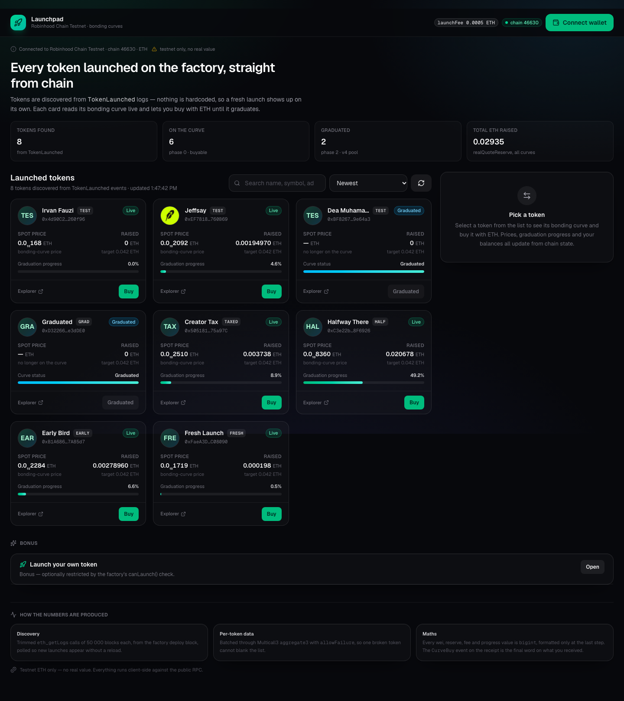

# Launchpad Robinhood Chain — daftar token & buy

Frontend untuk launchpad di **Robinhood Chain Testnet** (chain id `46630`). Aplikasi ini menemukan
setiap token yang pernah diluncurkan factory dari event on-chain, membaca bonding curve tiap token
secara live, dan memungkinkan Anda **buy** (dan **sell**) dengan ETH.

> Bahasa: **Indonesia** · [English](README.en.md)

Dibuat untuk brief on-site di [`technical-brief/TASK-BRIEF.md`](technical-brief/TASK-BRIEF.md)
(versi Inggris: [`technical-brief/TASK-BRIEF.en.md`](technical-brief/TASK-BRIEF.en.md)).



| | |
| --- | --- |
| Network | Robinhood Chain Testnet (`46630`) |
| LaunchFactory | [`0x533cE670f1372cb402D49866608b92e7bc2b4493`](https://explorer.testnet.chain.robinhood.com/address/0x533cE670f1372cb402D49866608b92e7bc2b4493) |
| Multicall3 | `0xcA11bde05977b3631167028862bE2a173976CA11` |
| Explorer | <https://explorer.testnet.chain.robinhood.com> |
| RPC | <https://robinhood-sepolia-rpc.publicnode.com> |

---

## Isi

Langkah 9 brief meminta lima hal. Semuanya ada di dokumen ini:

| Yang diminta langkah 9 | Di mana |
| --- | --- |
| Cara menjalankan project | [§1 Menjalankan project](#1-menjalankan-project) |
| Keputusan teknis penting dan alasannya | [§3 Arsitektur dan keputusan teknis penting](#3-arsitektur-dan-keputusan-teknis-penting) |
| Apa yang belum selesai | [§7 Yang belum selesai](#7-yang-belum-selesai), plus semua baris ⚠️ di [§2](#2-apa-yang-dikerjakan-langkah-19) |
| Bagian yang dibantu AI | [§8 Bantuan AI](#8-bantuan-ai) |
| Masalah pada brief atau kontrak | [§5 Masalah yang ditemukan pada brief dan kontrak](#5-masalah-yang-ditemukan-pada-brief-dan-kontrak) |
| Screenshot | [`demo/`](demo/README.md), bisa dibuat ulang dengan `scripts/screenshots.mjs` |

Sisanya, sebagai urutan baca:

- [§2 Apa yang dikerjakan (langkah 1–9)](#2-apa-yang-dikerjakan-langkah-19) — checklist brief dan screenshot
- [§4 Konfigurasi kontrak](#4-konfigurasi-kontrak) — semua address dan hasil baca live
- [§6 Verifikasi yang dijalankan](#6-verifikasi-yang-dijalankan) — apa yang benar-benar dijalankan, dan apa yang tidak
- [§9 Catatan demo](#9-catatan-demo) — alur demo yang disarankan

---

## 1. Menjalankan project

Kebutuhan: **Node.js 20.9+** (dikembangkan di Node 26) dan **MetaMask** di browser Chromium.

```bash
git clone https://github.com/aesencodes/launchpad-token-list-buy.git
cd launchpad-token-list-buy
npm install
npm run dev          # http://localhost:3000
```

Build produksi:

```bash
npm run build && npm start     # http://localhost:3000
```

**Tidak ada file `.env` dan tidak ada secret.** Semua nilainya publik: chain id, RPC publik, dan
alamat factory ada di [`lib/chain.ts`](lib/chain.ts) dan [`lib/contracts.ts`](lib/contracts.ts).

Pemeriksaan:

```bash
npm run lint         # eslint
npm run typecheck    # next typegen + tsc --noEmit
npm run build        # build produksi (sekaligus typecheck)
```

> Pakai `npm run typecheck`, jangan `npx tsc --noEmit` langsung: Next.js men-generate helper global
> `LayoutProps` / `PageProps` ke dalam direktori `.next/` (di-gitignore), sehingga di clone baru
> `tsc` saja gagal dengan `Cannot find name 'LayoutProps'` sampai ada satu perintah Next yang
> dijalankan. `npm run typecheck` menjalankan `next typegen` lebih dulu — itu sebabnya ia berhasil
> dari checkout yang bersih.

### Memakai aplikasi

1. Buka aplikasi — daftar token termuat tanpa wallet.
2. Klik **Connect wallet** lalu setujui di MetaMask.
3. MetaMask belum mengenal chain `46630`. Kalau wallet Anda ada di network lain, muncul banner
   dengan tombol **Switch to Robinhood Chain Testnet**; tombol yang sama juga *menambahkan*
   network tersebut (`wallet_switchEthereumChain`, dengan fallback ke `wallet_addEthereumChain`
   saat error 4902).
4. Ambil testnet ETH dari <https://faucet.testnet.chain.robinhood.com/> — faucet mengirim
   **0.01 ETH per klaim, sekali per 24 jam**. Sekali klaim sudah cukup: `gasPrice` ~0.01 gwei
   (satu buy memakai ~0.000002 ETH untuk gas) dan `launchFee()` 0.0005 ETH. Karena itu
   `scripts/check-wallet.mjs` default ke `--min 0.01`; naikkan lewat `--min` kalau perlu.
   Perlu diketahui bahwa faucet adalah langkah **manusia**: setelah bot check-nya, ia mewajibkan
   Cloudflare Turnstile **dan** sign-in Google, jadi tidak bisa diotomatisasi. Di sebagian jaringan
   (teramati pada ISP Indonesia) host-nya kena filter DNS dan resolve ke halaman blokir — situsnya
   baik-baik saja, resolver-nya yang tidak. Kalau tidak bisa dibuka, minta testnet ETH ke supervisor.
5. Pilih token (atau buka deep link `/?token=0x…`), isi jumlah ETH, lalu tekan **Buy**.

### Script pengembang / verifikasi

```bash
node scripts/verify-onchain.mjs                    # dump data launch live + semua event TokenLaunched
node scripts/verify-buy-quote.mjs <token> <eth>    # estimate UI vs hitungan Node vs eth_call kontrak
node scripts/check-wallet.mjs <address> --app      # saldo live + wiring wallet bar / network banner
node scripts/capture-live-trade.mjs <url> <dir>    # jalankan jalur buy/sell nyata dengan key berfund
node scripts/screenshots.mjs http://localhost:3000 demo   # buat ulang demo/*.png
node scripts/generate-abis.mjs                     # buat ulang lib/abi/*.ts dari technical-brief/abi
```

`check-wallet.mjs` membaca saldo address di chain 46630 dan mencetak baris `RECORD` yang siap
ditempel; dengan `--app` ia juga menjalankan aplikasi di headless Chrome dengan wallet EIP-1193
mock dan memastikan wallet bar menampilkan address dan saldo tersebut serta network banner
berpindah ke — atau menambahkan — chain 46630. Fase mock itu hanya bukti *wiring*: mendanai wallet
nyata adalah langkah manusia.

`verify-buy-quote.mjs` menjalankan aplikasi di headless Chrome, mengetik jumlah ke form buy, lalu
membandingkan tiga angka: yang dihitung UI, yang dihitung rumus yang sama di Node, dan yang
dikembalikan kontrak lewat `eth_call` ke `buy(...)`. Ketiganya sama sampai satuan wei —
lihat [§6](#6-verifikasi-yang-dijalankan).

`capture-live-trade.mjs` adalah harness live-trade. Ia menjalankan UI nyata melalui connect →
banner wrong-network → switch/add chain → buy → sell, dan menandatangani setiap transaksi secara
lokal dengan key wallet berfund yang disuplai saat runtime (`LIVE_TRADE_KEY`, `--key-file`, atau
`~/.launchpad-live.key`) — key tidak pernah masuk ke repo maupun ke halaman, dan `--expect` menolak
bertransaksi kalau key tidak menurunkan address yang dimaksud. Berbeda dari harness lain, wallet-nya
bukan mock: ia memegang akun nyata, meneruskan semua pembacaan ke RPC publik, dan menyiarkan
transaksi nyata.

---

## 2. Apa yang dikerjakan (langkah 1–9)

| Langkah | Status | Di mana |
| --- | --- | --- |
| 1 — project + network, tampilkan `launchFee()` | ✅ | `lib/chain.ts`, `lib/wagmi.ts`, header + stats di `app/page.tsx` |
| 2 — connect / disconnect, address, saldo ETH, switch **dan add** network | ✅ | `hooks/useWallet.ts`, `components/WalletBar.tsx`, `components/NetworkBanner.tsx` |
| 3 — daftar token dari `TokenLaunched`, `eth_getLogs` terpotong, polling live | ✅ | `lib/launchpad.ts`, `hooks/useTokenLaunches.ts` |
| 4 — data per-token lewat Multicall3 `aggregate3` + `allowFailure` | ✅ | `hooks/useTokenDetails.ts` |
| 5 — UI daftar, label phase, placeholder logo, state loading/empty/error | ✅ | `components/TokenList.tsx`, `components/TokenCard.tsx`, `components/TokenLogo.tsx` |
| 6 — form buy, estimate curve `bigint`, slippage, aturan tombol nonaktif | ✅ | `components/BuyForm.tsx`, `lib/bondingCurve.ts`, `lib/tokenInput.ts` |
| 7 — `buy(quoteIn, minTokensOut, recipient)`, kelima state transaksi, link explorer, terjemahan error | ⚠️ sudah ada, belum dijalankan | `hooks/useContractWrite.ts`, `hooks/useBuyToken.ts`, `lib/errors.ts` |
| 8 — refresh harga/progress/saldo ETH/saldo token tanpa reload | ⚠️ sudah ada, belum dijalankan | `hooks/useBuyToken.ts` (invalidate cache), `hooks/useTokenDetails.ts` (polling) |
| 9 — README + bukti visual | ✅ | dokumen ini + `demo/` |
| Bonus — launch token sendiri | ⚠️ sudah ada, belum dijalankan | `components/LaunchTokenForm.tsx`, `hooks/useLaunchToken.ts` |
| Bonus — sell | ⚠️ sudah ada, belum dijalankan | `components/SellForm.tsx`, `hooks/useSellToken.ts` |
| Bonus — sort + search | ✅ | `components/TokenList.tsx` |
| Bonus — menyelesaikan graduasi (`createGraduatedPool`) | ⚠️ sudah ada, belum dijalankan | `components/TradePanel.tsx`, `hooks/useGraduateToken.ts` |
| Bonus — halaman detail token dengan riwayat trade | ❌ | belum ada; deskripsi/socials/creator ditampilkan di tab Details |

`⚠️ sudah ada, belum dijalankan`: kode, input, dan panggilan kontrak yang dibangunnya sudah
diverifikasi (logika form plus simulasi `eth_call` terhadap curve live), tetapi **tidak ada
transaksi yang disiarkan** — environment ini tidak punya signer berfund. Langkah 7 dan 8 baru
memenuhi *done-when* brief setelah satu buy benar-benar mined di demo live; lihat
[§6](#6-verifikasi-yang-dijalankan) dan [§7](#7-yang-belum-selesai).

### Screenshot

| File | Isinya |
| --- | --- |
| `demo/01-desktop-list.png` | Daftar token, token ditemukan dari event (lebih dari 5 sample), harga dan progress |
| `demo/02-desktop-buy-form.png` | Panel buy untuk TAXED (creator tax 10 %); capture-nya berisi field jumlah yang kosong, jadi semua baris estimate terbaca `—` — angka 0.001 ETH yang terisi ditulis di [§6](#6-verifikasi-yang-dijalankan) |
| `demo/03-desktop-graduated-token.png` | GRAD di phase 2 — tanpa harga, buy nonaktif |
| `demo/04-mobile-list.png` | Layout 390 px |
| `demo/05-mobile-buy-form.png` | Panel buy sebagai sheet layar penuh di mobile |
| `demo/06-desktop-launch-token-form.png` | Form bonus launch token |

`demo/README.md` menjelaskan cara pembuatannya (headless Chrome lewat DevTools Protocol, jadi siapa
pun bisa membuat ulang). Keenamnya menampilkan keadaan **terputus (disconnected)**. Capture state
transaksi (`demo/07…16`: wallet tersambung → kelima state buy → sell) dihasilkan oleh
`scripts/capture-live-trade.mjs`, yang butuh signer berfund dan belum pernah dijalankan —
lihat [§7](#7-yang-belum-selesai).

---

## 3. Arsitektur dan keputusan teknis penting

```
app/
  layout.tsx           root layout, font, metadata (server component)
  providers.tsx        'use client' — WagmiProvider + QueryClientProvider
  page.tsx             'use client' — komposisi, polling, pemilihan token, deep link
  globals.css          entry Tailwind v4 + design token
components/            komponen presentasional + interaksi (flat, satu file per komponen)
hooks/                 semua data on-chain dan state transaksi
lib/
  chain.ts             definisi chain viem (RPC, explorer, Multicall3)
  contracts.ts         semua address + ukuran potongan 50 000 block
  wagmi.ts             createConfig (single chain, connector injected, ssr)
  abi/                 ABI generated `as const`
  bondingCurve.ts      matematika curve bigint murni (quoteBuy / quoteSell / slippage / harga / progress)
  launchpad.ts         discovery TokenLaunched terpotong per 50 000 block
  errors.ts            wallet/RPC/custom-error → pesan yang bisa dibaca manusia
  format.ts            format khusus tampilan (harga sangat kecil, jumlah token ringkas)
  tokenInput.ts        parse/validasi input pengguna tanpa float
  phase.ts             GraduationPhase → label/badge/perilaku
scripts/               helper dev-only (verifikasi, screenshot, generate ABI, live-trade capture)
technical-brief/       brief dan ABI yang diberikan (tidak diubah)
```

Keputusan penting dan alasannya:

1. **Discovery adalah satu-satunya sumber token.** Tidak ada alamat sample token di kode aplikasi
   (`app/`, `components/`, `hooks/`, `lib/`). Harness dev-only memang memakai TAXED/GRAD sebagai
   contoh target (`scripts/screenshots.mjs`, `scripts/verify-buy-quote.mjs`) — itu sebabnya
   discovery tetap terbukti bekerja tanpanya. `lib/launchpad.ts` memindai `TokenLaunched` dari
   block deploy factory (`129157568`) sampai `latest` dalam potongan 50 000 block — RPC publik
   menolak rentang yang lebih besar — dengan 4 request paralel, lalu dedup berdasarkan alamat
   token. Pemindaian diulang tiap interval polling, bukan disimpan di balik cursor: terukur pada
   2026-10-06 di block 129,793,180 hasilnya 13 request per pemindaian, dan jumlah itu diturunkan
   dari `latest`, jadi tetap benar kalau ada launch baru saat halaman terbuka atau node reorg.
2. **Pembacaan per-token adalah satu batch Multicall3 datar.** `hooks/useTokenDetails.ts` menyusun
   array kontrak dengan stride tetap (13 panggilan per token: name, symbol, logo, decimals,
   description, `getReserves`, `realQuoteReserve`, `graduationThreshold`, `readyToGraduate`,
   `feeBps`, `creatorTaxBps`, `getLaunchedToken`, `balanceOf`) dan mengirimnya lewat `aggregate3`
   dengan `allowFailure: true` dan `batchSize: 64`. Satu token rusak hanya menurunkan kualitas
   kartunya, bukan mengosongkan seluruh daftar.
   `balanceOf` selalu disertakan (dengan `0x0` saat wallet terputus) supaya bentuk array — dan
   karena itu aritmetika indeksnya — tidak pernah berubah.
3. **Semua aritmetika memakai `bigint`.** `lib/bondingCurve.ts` murni dan tanpa framework. Nilai
   wei tidak pernah dikonversi ke `Number`; satu-satunya pemanggilan `Number()` hanya untuk nilai
   yang memang sudah satuan tampilan (persentase basis point, indeks daftar, `phase`).
4. **Harga diformat sesuai besaran aslinya.** Harga di sini ~1e7–1e8 wei per token, jadi
   `formatUnitsSignificant` menampilkan digit signifikan dan jatuh ke notasi subscript
   (`0.0₁₀2092`). `0.00` tidak pernah ditampilkan; kalau curve sudah tidak punya token, harganya
   `—`.
5. **Progress dihitung dengan istilah milik kontrak.** `realQuoteReserve / graduationThreshold`
   dalam basis point, dibatasi 10 000. Itu persis pemicu kontraknya: `initialize()` mencadangkan
   `supply · phantomQuote / (phantomQuote + threshold)` token, dan invarian constant-product
   membuat alokasi yang bisa dijual habis tepat saat real quote reserve mencapai threshold.
6. **Estimate adalah prediksi sisi klien; receipt adalah kebenarannya.** UI menampilkan hasil
   rumus, tetapi saat sukses ia mem-parse `CurveBuy` dari receipt (`parseEventLogs`) dan
   melaporkan `tokensOut` *dari event itu*; kalau event-nya hilang, ia jatuh ke selisih saldo
   recipient.
7. **Slippage diterapkan ke estimate, bukan ke reserve.** `minTokensOut =
   tokensOut · (10000 − slippageBps) / 10000`, default 1 %, dengan preset 0.5/1/2/5/10 %.
8. **Satu tempat memutuskan "transaksi ini boleh dikirim atau tidak".** `BuyForm`/`SellForm`
   mengumpulkan blocker (wallet belum tersambung, chain salah, jumlah tidak bisa di-parse / nol /
   terlalu banyak desimal, saldo tidak cukup, output nol, phase ≠ 0, curve sudah
   `readyToGraduate`, pair bukan ETH) lalu menonaktifkan tombol **Buy** / **Sell**. Kalau
   satu-satunya sisa masalah adalah aksi wallet, tombol **Connect wallet** / **Switch network**
   yang *terpisah* dirender di atasnya dan tetap aktif — tombol Buy/Sell sendiri tidak pernah
   aktif, sehingga klik tidak mungkin mencoba transaksi yang tidak bisa dikirim. Predikat curve
   yang dipakai bersama ada di `lib/phase.ts` (`isGraduationPending`).
9. **Error diterjemahkan, bukan dibuang mentah.** `lib/errors.ts` memetakan custom error kontrak
   (`SlippageExceeded`, `CurveGraduated`, …) plus penolakan wallet, saldo kurang, dan chain tidak
   cocok menjadi pesan pendek yang terbaca. Hex mentah tidak pernah ditampilkan.
10. **`msg.value` sama persis dengan `quoteIn`** (`NativeValueMismatch` kalau tidak), dan
    `recipient` selalu akun yang tersambung.
11. **Cache query adalah mekanisme refresh-nya.** Buy/sell yang sukses meng-invalidate cache
    TanStack Query, sehingga daftar, panel, dan kedua saldo wallet membaca ulang state chain tanpa
    reload halaman. Daftar juga polling (20 s) dan detail polling (15 s), jadi pembelian orang lain
    muncul sendiri.
12. **Permukaan dependensi seminimal mungkin.** Next.js 16 + React 19 + wagmi v3 + viem v2 +
    TanStack Query v5 + Tailwind v4 + `lucide-react` (ikon). Tanpa ethers.js, tanpa RainbowKit,
    tanpa Redux/Zustand, tanpa backend, tanpa API route, tanpa database.
    `multiInjectedProviderDiscovery` dimatikan supaya hanya ada satu tombol connect, bukan satu per
    pengumuman EIP-6963, dan `ssr: true` menjaga render server dan render klien pertama identik.
13. **ABI di-generate, bukan ditulis tangan.** `scripts/generate-abis.mjs` menyaring
    `technical-brief/abi/*.json` menjadi modul `as const` bertipe di `lib/abi/` (semua custom error
    dipertahankan agar viem bisa men-decode revert). Jalankan ulang script itu daripada mengedit
    file-file tersebut.

### Deep link

`/?token=0x…` langsung memilih satu token dan membuka panel trade-nya — diimplementasikan dengan
`useSyncExternalStore` (`hooks/useQueryParam.ts`) supaya render server tetap deterministik dan
tidak ada hydration mismatch.

---

## 4. Konfigurasi kontrak

Semuanya berasal dari tabel di brief dan sudah diverifikasi ulang terhadap chain live serta source
Sourcify (`https://repo.sourcify.dev/46630/0x533cE670f1372cb402D49866608b92e7bc2b4493`).

| | |
| --- | --- |
| Chain id | `46630` |
| Native currency | ETH, 18 desimal |
| Block deploy factory | `129157568` |
| Batas `eth_getLogs` | 50 000 block per request (ukuran potongan yang dipakai) |
| Multicall3 | `0xcA11bde05977b3631167028862bE2a173976CA11` |

Saat dokumen ini ditulis (block ~129.7M):

| Pembacaan | Nilai |
| --- | --- |
| `launchFee()` | `500000000000000` wei = 0.0005 ETH |
| `launchConfigCount()` | 2 |
| `getLaunchConfig(0)` | supply 1e27, curveFeeBps 100, phantomQuote 1.68e18, threshold 4.2 ETH |
| `getLaunchConfig(1)` | supply 1e27, curveFeeBps 100, phantomQuote 1.68e16, threshold **0.042 ETH** |
| `maxCreatorTaxBps()` | 1000 (10 %) |
| `previewLaunchEconomics(1, 0x0)` | `0x416423331ca6d9743485ce8245e1e90c61c04176b119bc0224ad64d76cd7537e` (berubah mengikuti fee policy) |

Phase (`enum GraduationPhase`): `0 NotGraduated` (bisa dibeli), `1 Swept`, `2 PoolCreated`,
`3 Rescued`.

---

## 5. Masalah yang ditemukan pada brief dan kontrak

Brief menyatakan bahwa source kontrak yang menang. Semua di bawah ini dicek terhadap source
Sourcify yang terverifikasi dari factory/curve yang ter-deploy dan terhadap pembacaan live. Tidak
ada yang *salah* di brief; ini tempat-tempat di mana brief kurang lengkap atau bisa menyesatkan.

1. **Brief tidak menyebut anti-snipe tax di rumus buy.** `BondingCurve.buy()` yang ter-deploy
   memungut `snipeTax = spent · snipeTaxBps / 10000` di atas fee dan creator tax, di mana
   `snipeTaxBps` mulai dari **9900 (99 %)** pada detik peluncuran dan meluruh ke nol di akhir
   window (right shift 14 langkah, yaitu separuh setiap `window / 14`). Kedua angka itu **nilai
   konfigurasi per-deployment, bukan konstanta source**: `snipeTaxStartBps()` dan
   `snipeTaxSeconds()`, di-snapshot per curve saat `initialize()`, jadi bacalah per curve. Terukur
   live pada 2026-10-06 terhadap factory dan semua 16 curve launch: `snipeTaxStartBps = 9900`,
   `snipeTaxSeconds = 3` — window **3 detik**, bukan 15 s (kedua pembacaan dicetak per curve oleh
   `scripts/verify-onchain.mjs`). Jadi rumus di brief *melebih-lebihkan* token yang diterima untuk
   buy yang diletakkan di detik-detik pertama sebuah launch baru. Perlu dicatat kontraknya juga
   membatasi total potongan sehingga pembeli tetap memegang minimal 1 % dari belanjanya. Ini tidak
   memengaruhi sample token (semuanya sudah jauh melewati window-nya) dan tidak memengaruhi
   receipt, yang bersifat otoritatif. Ini *layak* diketahui kalau Anda meluncurkan token sendiri
   lalu langsung membelinya — dan justru karena itu form launch tidak otomatis buy.
2. **"Curve reserve" termasuk likuiditas virtual.** `getReserves()` mengembalikan
   `quoteReserve = phantomQuote + trackedQuote − quoteFeeBalance − creatorTaxBalance`. Untuk
   config 1 phantom reserve-nya `0.0168 ETH`, jadi untuk token baru `quoteReserve` yang dilaporkan
   adalah `0.0168 ETH` sementara `realQuoteReserve()` (angka "ETH terkumpul") adalah `0`. Brief
   benar menyebut keduanya, tetapi harga (`quoteReserve / tokenReserve`) dan progress
   (`realQuoteReserve / graduationThreshold`) sengaja berasal dari besaran yang berbeda — harganya
   bukan `raised / supply`.
3. **`SlippageExceeded` adalah batas harga, bukan batas kuantitas.** Kontrak memeriksa
   `spent · minTokensOut > received · tokensOut`. Itu identik dengan `tokensOut >= minTokensOut`
   saat seluruh jumlah terpakai, tetapi buy yang akan melewati alokasi yang dicadangkan curve akan
   **dipotong dan dikembalikan** (`CurveBuyRefunded`) alih-alih ditolak. Jadi buy terakhir sebelum
   graduasi bisa sukses dengan token lebih sedikit (dan belanja lebih kecil) daripada yang
   diminta. Turunan `minTokensOut` kita tetap benar; `quoteIn` pada event receipt adalah yang
   benar-benar terpakai, dan pesan sukses melaporkan `tokensOut` dari event itu.
4. **Token yang sudah lulus graduasi tidak punya harga sama sekali.** Setelah graduasi, curve
   menyerahkan reserve-nya ke factory, sehingga `tokenReserve == 0` dan `realQuoteReserve == 0`
   untuk GRAD (phase 2). Pembagian akan menjadi bagi nol, dan `0.00` akan melanggar aturan
   format brief. UI menampilkan `—` untuk harga, `Graduated` alih-alih persentase progress, dan
   menonaktifkan form.
5. **`getLaunchedToken()` tidak revert untuk token yang tidak dikenal.** Ia mengembalikan struct
   nol, jadi `phase == 0` dengan `exists == false` berarti "bukan launch dari factory ini", bukan
   "sedang di curve". Aplikasi tidak pernah bergantung pada ini (event log adalah sumber
   kebenarannya), tetapi ini jebakan kalau Anda memakai struct itu sebagai uji keanggotaan.
6. **Jumlah potongan (chunk).** Brief menyebut "sekitar 7 request hari ini". Terukur pada
   2026-10-06 di block 129,793,180, rentang block deploy → head adalah 635,613 block, yaitu **13**
   request dengan 50 000 block masing-masing. Perlakukan angka ini sebagai snapshot bertanggal:
   kodenya menurunkan jumlah dari `latest`, jadi tetap benar seiring chain bertumbuh, dan
   `scripts/verify-onchain.mjs` mencetak rentang yang benar-benar diminta.
7. **Testnet ini dipakai bersama.** Token `TEST` tambahan dari kandidat lain sudah ada (16 launch
   pada 2026-10-06, dibanding 5 sample token), jadi daftarnya menampilkan lebih dari lima. Itu
   perilaku yang diinginkan dan sekaligus bukti bahwa discovery-nya dinamis — tidak ada perubahan
   kode yang diperlukan agar mereka muncul. Kelima sample token ada di alamat yang diharapkan.
8. **Pair non-ETH diizinkan factory tetapi belum ada.** `pairToken` adalah `address(0)` untuk
   semua launch yang teramati sejauh ini. UI tetap menampilkan token seperti itu di daftar
   (ditandai `Non-ETH pair`) dan menonaktifkan buy/sell-nya, dengan alasannya ditampilkan, bukan
   disembunyikan.
9. **`Phase 1` tidak punya sample token.** Brief menyebut hal ini; kodenya tetap menangani phase 1,
   termasuk tombol opsional `createGraduatedPool(token)`.
10. **Peringatan hydration khusus dev.** Dengan `next dev` (Turbopack), React mencatat hydration
    mismatch pada kelas variabel `next/font` di elemen `<html>`. Itu artefak dev-server Next.js:
    build produksi termuat **tanpa error atau warning di console** (dicek dengan menjalankan build
    di headless Chrome dan merekam console-nya — lihat `scripts/screenshots.mjs`).
11. **Sebuah curve bisa tertutup sementara phase factory masih `NotGraduated`.** `buy()`
    mengembalikan kelebihan di luar alokasi yang dicadangkan alih-alih menolak, sehingga buy
    terakhir bisa menyisakan `sellableTokens() == 0`. Di akhir buy yang sama, curve memanggil
    `factory.graduate(token)` di dalam `_tryAutoGraduate`, yang menelan kegagalan preflight
    graduasi dan hanya mengeluarkan `AutoGraduationFailed`. Curve lalu tertutup di **kedua** sisi —
    `sell` revert `if (graduated || readyToGraduate())`, dan `buy` revert pada pemeriksaan
    `sellable == 0` miliknya sendiri — sementara `phase` masih `0`. Jadi `phase == 0` tidak cukup
    untuk berarti "bisa ditradingkan": flag otoritatifnya adalah `readyToGraduate()` milik curve
    (`sellableTokens() == 0`, `false` begitu `graduated`), yang dibaca aplikasi lewat Multicall3
    dan dipakai memblokir kedua form. Di state ini sengaja **tidak ada tombol**: `createGraduatedPool`
    mensyaratkan phase `1` (`Swept`), `graduate` akan mengulang preflight yang baru saja gagal, dan
    `sell`/`buy` tertutup secara desain agar pool tetap terisi pada harga graduasi yang
    deterministik. Panel menjelaskan itu alih-alih menawarkan aksi yang tidak mungkin berhasil.
    Tidak ada sample token di state ini (kelimanya membaca `readyToGraduate == false`), jadi
    guard-nya diverifikasi lewat source dan selector live, bukan dengan didemokan;
    `scripts/verify-onchain.mjs` mencetak flag itu per token.

---

## 6. Verifikasi yang dijalankan

Otomatis:

- `node scripts/check-wallet.mjs <address> --app <url>` — preflight wallet, dijalankan terhadap
  build produksi dengan wallet EIP-1193 mock: 12/12 pemeriksaan lulus, termasuk banner
  wrong-network, `wallet_switchEthereumChain` untuk chain 46630, fallback `4902` →
  `wallet_addEthereumChain` dengan RPC/explorer/currency repo ini, dan wallet bar yang menampilkan
  address beserta saldo live. Jalur saldo kurang juga diuji (address di bawah `--min` gagal di
  pemeriksaan saldo saja, tidak yang lain). Ini membuktikan sisi aplikasi dari langkah 2 (connect,
  saldo, switch/add network); ia tidak bisa membuktikan bahwa wallet nyata benar-benar berisi dana —
  itu langkah pendanaan di bawah.
- `npm run lint`, `npm run typecheck`, `npm run build` — semua bersih.
- `node scripts/verify-onchain.mjs` — mencetak data launch live. Dipakai untuk memastikan kelima
  sample token, nilai phase, `launchFee()`, launch config, dan digest economics.
- `node scripts/verify-buy-quote.mjs 0x505181e3114a6d147839Cb809C84d4e83575a97C 0.001` —
  pemeriksaan utamanya. Ia menjalankan form buy **dan sell** yang asli di browser nyata dan
  membandingkan nilai UI, rumus Node, dan kontrak:

  ```
  BUY  0.001 ETH
    UI                 tokensOut=33975002796257252613307588
    node               tokensOut=33975002796257252613307588
    contract eth_call  tokensOut=33975002796257252613307588
    UI                 minTokensOut=33635252768294680087174512
    UI                 fee=10000000000000  creatorTax=100000000000000
  SELL 1 TAXED
    UI                 quoteOut=22345857
    node               quoteOut=22345857
    contract eth_call  quoteOut=22345857

  PASS  buy: UI tokensOut == node estimate
  PASS  buy: UI fee == node fee
  PASS  buy: UI creatorTax == node creatorTax
  PASS  sell: UI quoteOut == node estimate
  PASS  buy: node estimate == contract tokensOut
  PASS  buy: UI estimate == contract tokensOut
  PASS  sell: node estimate == contract quoteOut
  PASS  sell: UI estimate == contract quoteOut
  ```

  `eth_call`-nya sekaligus membuktikan kedua panggilan well-formed: selector benar, urutan argumen
  benar, `msg.value == quoteIn` untuk buy, dan state curve yang menerimanya. Simulasi sell hanya
  menimpa storage slot saldo/allowance ERC-20 milik pemanggil (slot 0 dan slot 1 token), sehingga
  logika harga milik curve tetap berjalan terhadap reserve nyata.
- `node scripts/capture-live-trade.mjs <url> demo` — harness live-trade untuk langkah 7 (issue #7).
  Dijalankan dengan key wallet berfund, ia menghasilkan `demo/07…16` (wallet tersambung, banner
  wrong-network, GRAD nonaktif, `Confirm in wallet` → pending → sukses dengan jumlah yang diterima
  → rejected → reverted, lalu pasangan approve → sell) dan mencetak setiap hash yang mined,
  mem-parse `tokensOut`/`quoteOut` dari event `CurveBuy`/`CurveSell` pada receipt.
  **Belum dijalankan dengan signer berfund** — lihat [§7](#7-yang-belum-selesai). Yang *sudah*
  terverifikasi: dengan key tanpa dana ia menyelesaikan connect, banner wrong-network, switch
  `4902` → add-network, deep link, state GRAD nonaktif, dan estimate `bigint`, lalu berhenti persis
  di tempat yang seharusnya — tombol buy nonaktif karena saldo wallet nol, jadi tidak ada transaksi
  yang dicoba. Jalur signing-nya juga dicek langsung ke node: transaksi yang dibangunnya ditolak
  hanya karena saldo kurang, bukan karena encoding atau urutan argumen.
- Perekaman console headless-Chrome untuk keenam screenshot — tidak ada error atau warning di build
  produksi.
- **Uji fresh clone:** branch yang di-push di-clone ke direktori kosong, di-`npm ci`, lalu
  `npm run lint`, `npm run typecheck`, dan `npm run build` dijalankan berurutan — semuanya bersih.
  Ini yang memunculkan kebutuhan `next typegen` yang didokumentasikan di atas.

Manual (yang sebaiknya Anda lakukan, dan yang tidak bisa saya lakukan):

- Sambungkan MetaMask, cek saldo dan network banner, lalu **beli satu token** (FRESH, EARLY, dan
  TAXED paling aman) dan pastikan: state pending, link explorer, pesan sukses berisi jumlah yang
  diterima, dan kartunya — harga/progress plus kedua saldo — berubah tanpa reload.
- Jual sebagian kecil kembali (FRESH/EARLY punya headroom paling banyak) untuk menguji alur
  approve → sell. Sell memakai rumus yang sama dan parsing receipt yang sama (`CurveSell`).
- Luncurkan token Anda sendiri dari form bonus (nama + ticker `TEST`, launch config `1`). Form-nya
  sudah ada dan input-nya sudah diverifikasi; siarannya tetap harus Anda tandatangani.

**Tidak dieksekusi di sesi ini:** siaran transaksi buy/sell/launch yang sebenarnya. Environment
tempat ini dibangun tidak punya akun MetaMask berfund untuk menandatangani, dan key/seed phrase
testnet tidak boleh di-commit. Jadi jalur kode transaksinya diverifikasi lewat simulasi kontrak dan
lewat konstruksinya, bukan lewat hash yang mined — itulah hal utama yang perlu dikonfirmasi di demo
live. `scripts/capture-live-trade.mjs` ada untuk menutup celah itu dengan satu perintah; ia masih
butuh signer berfund (di bawah).

---

## 7. Yang belum selesai

- **Belum ada transaksi buy/sell/launch yang mined** (lihat di atas). Semua yang terjadi sebelum
  signing sudah diverifikasi terhadap kontrak live, termasuk `tokensOut`/`quoteOut` persis yang
  dikembalikan curve. Sesi agen tidak bisa menutup ini sendiri: satu-satunya signer adalah wallet
  berfund yang key-nya ada di MetaMask, dan faucet yang mendanainya dijaga Cloudflare Turnstile
  **plus Google Sign-In** (dan host-nya diblokir DNS di sebagian ISP), sehingga tidak bisa
  dijalankan headless. Wallet berfund dari issue #5 berisi 0.11 ETH di chain 46630 dengan `nonce` 0,
  jadi satu perintah sudah cukup: ekspor key akun testnet itu ke `~/.launchpad-live.key` (atau set
  `LIVE_TRADE_KEY`) lalu jalankan
  `node scripts/capture-live-trade.mjs http://localhost:3000 demo`.
- **Halaman detail token dengan riwayat trade** (salah satu bonus) belum ada. Tab Details
  menampilkan deskripsi, creator, deployer, socials, launch config, threshold, dan alamat kontrak;
  tidak ada tabel riwayat `CurveBuy`/`CurveSell`.
- **Anti-snipe tax tidak dimodelkan di estimate** (lihat temuan 1). UI menampilkan rumus brief dan
  receipt-nya yang mengoreksi.
- **Rescan log penuh di tiap polling.** Masih wajar di ukuran chain ini (13 request / 20 s,
  2026-10-06); deployment nyata akan memindahkan discovery ke backend ber-indeks atau menyimpan
  cursor yang persisten.
- **Belum ada test suite otomatis.** Verifikasi lewat script di atas plus menjalankan browser;
  menambahkan unit test untuk `lib/bondingCurve.ts` dan `lib/format.ts` adalah langkah berikutnya
  yang paling pertama.
- **Token pair non-ETH tidak bisa ditradingkan** di UI ini meskipun factory mendukungnya.

---

## 8. Bantuan AI

Project ini ditulis dengan agen coding AI (Pi, menjalankan Claude) berdasarkan brief, ABI yang
diberikan, dan source Sourcify yang terverifikasi. Secara konkret:

- **Dibuat AI:** hampir seluruh kode — `lib/*`, `hooks/*`, `components/*`, `app/*`, keenam helper
  `scripts/*.mjs`, README ini, dan panduan `AGENTS.md`.
- **Verifikasi yang dijalankan AI:** membaca source Sourcify untuk memastikan rumus curve, enum
  `GraduationPhase`, dan custom error; penulisan ulang bebas-`effect` untuk memenuhi aturan lint
  React Compiler; harness simulasi `eth_call` (`verify-buy-quote.mjs`); preflight wallet dan
  harness live-trade yang benar-benar menandatangani; perekaman console dan screenshot di
  headless Chrome; serta review dua sumbu (Standards + Spec) atas harness itu sebelum di-commit.
- **Tanggung jawab manusia:** pemilihan stack, arah desain, keputusan menyertakan bonus
  sell/launch/graduasi, dan meninjau serta mendemokan hasilnya. Brief menegaskan bahwa Anda harus
  memahami setiap bagian yang diserahkan, termasuk bagian yang dibantu AI.

AI sengaja **tidak** diizinkan untuk: menambah dependensi, menyalin kode atau alamat dari project
lain, meng-hardcode sample token, memakai `Number` untuk nilai chain, atau push apa pun ke GitHub.

---

## 9. Catatan demo

- Biarkan aplikasi tetap berjalan dengan `npm run dev` dan demo dari clone bersih memakai langkah di
  [§1](#1-menjalankan-project).
- Alur demo yang disarankan: tunjukkan daftar yang terisi dari event (jauh lebih dari lima token,
  termasuk buatan kandidat lain) → sambungkan wallet lalu switch/add network → buka TAXED dan ketik
  sebuah jumlah supaya estimate dan pemisahan fee/creator tax berubah saat Anda mengetik → buy →
  tunjuk harga/progress dan saldo yang berubah sendiri → buka GRAD untuk menunjukkan state
  nonaktif → tampilkan `Details` → tampilkan form bonus launch → jalankan
  `scripts/verify-buy-quote.mjs` untuk membuktikan angkanya cocok dengan kontrak.
- Screenshot di `demo/` diambil dari build produksi dan bisa dibuat ulang dengan
  `node scripts/screenshots.mjs http://localhost:3000 demo`.
